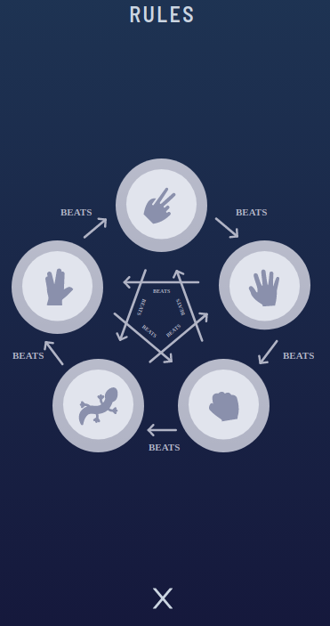

# Rock-Paper-Scissors-Lizard-Spock

This is an implementation of Rock-Paper-Scissors-Lizard-Spock, a variant of the classic game Rock-Paper-Scissors. The game is played against the computer, who each choose from one of five available options.

The rules of this violent game are:

- Scissors cuts Paper
- Paper covers Rock
- Rock crushes Lizard
- Lizard poisons Spock
- Spock smashes Scissors
- Scissors decapitates Lizard (๑•́o•̀๑)
- Lizard eats Paper
- Paper disproves Spock (,,>﹏<,,)
- Spock vaporizes Rock
- Rock crushes Scissors

#### Screenshots

  
  
  
  

#### Technologies used

- [React](https://react.dev/)
- [TypeScript](https://www.typescriptlang.org/)
- [Tailwind CSS](https://tailwindcss.com/)
- [Create-T3-App](https://create-t3-app-docs.vercel.app/en/introduction)
- [tailwind-styled-components](https://www.npmjs.com/package/tailwind-styled-components)
- [Cypress](https://www.cypress.io/)
- [Next.js](https://nextjs.org/)
- [Vercel](https://vercel.com/)

This is a remake of the [Rock-Paper-Scissors](https://github.com/Athma-Vasi/Rock-Paper-Scissors) Odin Project assignment and I used the challenge from [Frontend Mentor](https://www.frontendmentor.io/challenges/rock-paper-scissors-game-pTgwgvgH) as inspiration. Sketch and Figma files were for premium users only, so I used the firefox colour picker tool to get the colours. (≧▽≦)

**Here is the challenge brief**

Your challenge is to build out this Rock, Paper, Scissors game and get it looking as close to the design as possible.

You can use any tools you like to help you complete the challenge. So if you've got something you'd like to practice, feel free to give it a go.

Your users should be able to:

- View the optimal layout for the game depending on their device's screen size
- Play Rock, Paper, Scissors against the computer
- Maintain the state of the score after refreshing the browser (optional)
- Bonus: Play Rock, Paper, Scissors, Lizard, Spock against the computer (optional)
